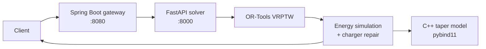

<div align="center">

# EV Fleet Routing

**Route electric delivery fleets through capacity, time-window, battery, and charging constraints.**

[](solver/)
[](solver/src/evsolver/ortools_vrptw.py)
[](cpp_energy/)
[](java-service/)

</div>

EV Fleet Routing is a polyglot optimization prototype for a practical constraint that conventional vehicle-routing demos ignore: an electric route is only useful if the vehicle can finish it without violating its minimum state of charge.

## What it solves

The Python service first solves a capacitated vehicle-routing problem with time windows (VRPTW), then simulates energy use and repairs infeasible routes by inserting available chargers. The response includes arrival and departure times, state of charge, energy added, charging time, and any remaining violations for every stop.

| Constraint | Implementation |
|---|---|
| Fleet capacity | OR-Tools vehicle-capacity dimension |
| Customer time windows | OR-Tools time dimension with waiting slack |
| Route objective | configurable minimum time or minimum distance |
| Battery use | distance × per-vehicle energy consumption |
| Charger selection | greedy minimum-added-travel-time insertion |
| Charging duration | native C++ piecewise taper curve through pybind11 |
| Availability and delay | station availability plus expected wait time |

## Architecture



The native charging model applies full station power below 80% state of charge, 60% from 80–90%, and 30% from 90–100%. If the extension is unavailable, the Python service falls back to a linear charging estimate.

## Run locally

Requirements: Python 3.10+, a C++17 toolchain with CMake, and optionally Java 17 + Maven for the gateway.

### 1. Build the charging extension

```bash
cd cpp_energy
python -m pip install --upgrade pip
python -m pip install -e .
cd ..
```

### 2. Start the solver

```bash
cd solver
python -m pip install -r requirements.txt
python -m pip install -e .
uvicorn evsolver.api:app --reload --port 8000
```

In another terminal, run the deterministic Toronto-area demonstration:

```bash
cd solver
python scripts/run_demo.py
```

FastAPI exposes interactive documentation at `http://localhost:8000/docs` and health at `GET /health`.

### 3. Start the Java gateway (optional)

```bash
cd java-service
mvn spring-boot:run
```

The gateway forwards `POST /solve` and `GET /health` to the Python service and listens on `http://localhost:8080`.

## Response shape

Each route reports its vehicle and an ordered list of stops:

```json
{
  "feasible": true,
  "routes": [
    {
      "vehicle_id": "veh-0",
      "stops": [
        {
          "node_id": "charger-2",
          "arrival_min": 34,
          "depart_min": 49,
          "soc": 0.71,
          "charge_added_kwh": 8.4,
          "charge_time_min": 15
        }
      ],
      "feasible": true,
      "violations": []
    }
  ],
  "solver_stats": { "status": "ok", "objective": 42150.0 }
}
```

Values above illustrate the API contract; actual routes depend on the request matrices and constraints.

## Verification

```bash
cd solver
pytest
```

The included smoke test validates that the deterministic demo scenario produces routes. The API returns explicit feasibility and violation information rather than silently presenting an energy-invalid plan as successful.

## Repository map

| Path | Responsibility |
|---|---|
| `solver/src/evsolver/ortools_vrptw.py` | capacity/time-window routing model and search strategy |
| `solver/src/evsolver/energy.py` | energy accounting, charging, and route simulation |
| `solver/src/evsolver/repair.py` | charger-insertion repair loop |
| `cpp_energy/` | pybind11 extension for tapered charging time |
| `java-service/` | reactive Spring gateway to the solver |

## Design boundary

This is an intentionally inspectable MVP. Energy feasibility is evaluated and repaired after the initial VRPTW solve; state of charge is not yet part of the optimization state itself. That makes the solution easier to reason about and ship, but it is not globally optimal and a route can remain infeasible when no suitable charger exists. A production solver would jointly optimize routing and charge state, consume live travel/station data, and benchmark solution quality across representative fleet workloads.
